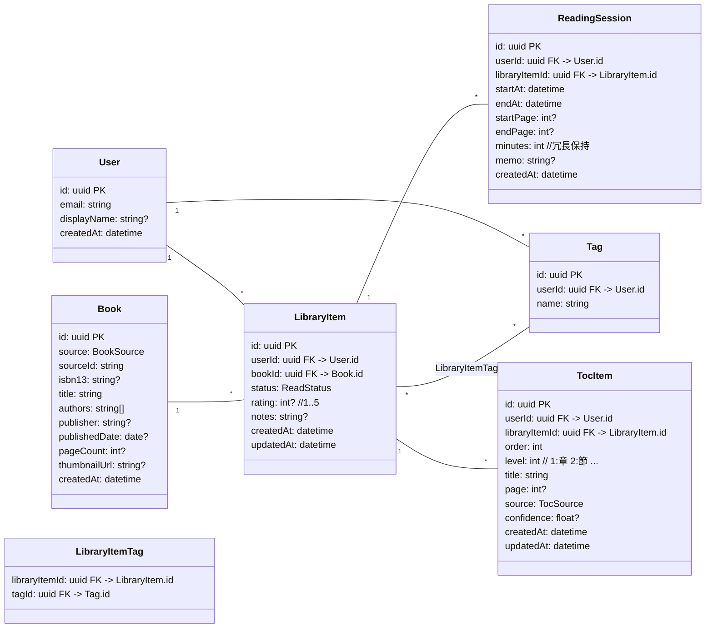
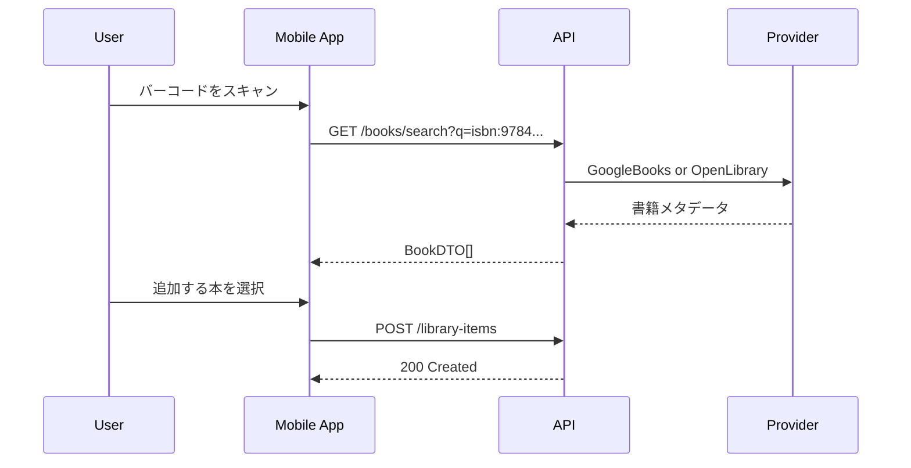
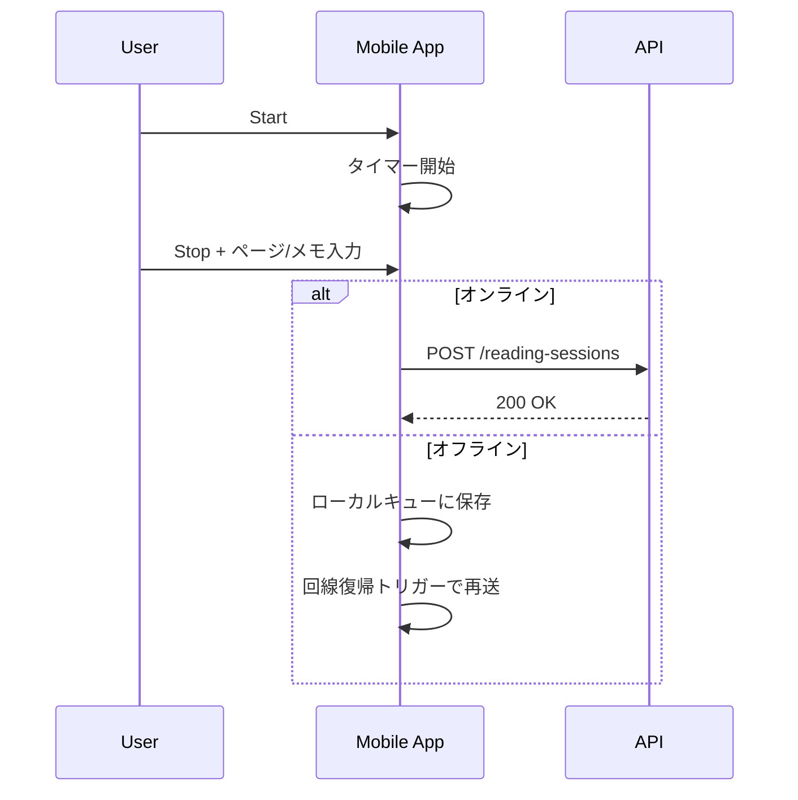

# book-journal 設計パック v0.1

最終更新: 2025-08-31 (JST)
作成目的: **モバイル/WEB両対応の「読書記録アプリ」(book-journal)** を短期間で試作→ローンチするための、要件定義/設計/実装タスク/Claude Code への発注テンプレをひとまとめにしたドキュメント。

---

## 0. 前提 / 方針 / 想定技術

### 0.1 前提とゴール
- **ゴール:** 読書の記録・振り返りを “最小ストレス” で継続できる体験を提供。モバイル中心 (iOS/Android) + Web で同一アカウント利用。
- 最初の 4 週間で **MVP** を出す。以降 2 週間スプリントで改善。
- **KGI(初期):** 4週後の 7日継続率 25% 以上、平均登録書籍数 5 冊/ユーザー、週あたり記録回数 3 回以上。

### 0.2 スコープ (MVP v0)
- 書籍の追加: 検索(書名/著者/ISBN) と 手動登録、バーコード(ISBN)スキャン(モバイル)
- 読書セッション記録: 開始/終了、ページ/時間、メモ(要約/気づき)
- 本棚(ライブラリ)管理: 状態(読みたい/読んでる/読了)、タグ付け、評価(☆1〜5)
- 統計: 月ごとの読書時間/冊数、連続記録(ストリーク)
- データ同期: オンライン前提 + 簡易オフライン(キャッシュ→再送)
- エクスポート: CSV (書籍/セッション/メモ)

**非スコープ(v0では入れない):** SNS共有、引用の自動抽出、複数ユーザー共同本棚、OCR 付きハイライト同期 等

### 0.3 想定技術スタック (提案)
- **フロント:** React Native (Expo) / Web は Next.js (App Router)
- **言語:** TypeScript
- **状態:** Zustand + React Query (Query Persistence)
- **バックエンド:** NestJS + Prisma + PostgreSQL（**Supabase** 利用を推奨: Auth/DB/Storage/Edge Functions）
- **認証:** Supabase Auth (Email+Link / OAuth)
- **検索API(外部):** Google Books / Open Library にアダプタで抽象化
- **CI/CD:** GitHub Actions → Expo EAS / Vercel / Supabase
- **計測:** PostHog or Amplitude (Event設計付属)

> ※既存のご嗜好: モノレポ (Yarn workspaces)、NestJS、Supabase、TypeScript を前提にテンプレ化。

---

## 1. ユーザー/価値仮説/ユースケース

### 1.1 ペルソナ
- **P1: 忙しい個人開発者/社会人** — スキマ時間に読書。メモ/要約を軽く残したい。通知は控えめ。
- **P2: 学習者(資格/語学)** — 学習時間の可視化とストリーク維持が動機。
- **P3: 親子読書** — 子供の読書記録を代理で付ける(将来: 子アカ/共有は拡張)。

### 1.2 価値仮説
- 入力摩擦が小さいほど継続される → **1タップ開始/終了** と **直近本のクイック記録** を最優先。
- 「積読の可視化」「ストリーク」など軽いゲーミフィケーションで行動喚起。

### 1.3 主要ユーザーストーリー (MVP)
- US-001: ユーザーとして、**本を検索して追加** したい（タイトル/著者/ISBN）。
- US-002: ユーザーとして、**バーコードスキャンで本を追加** したい（モバイル）。
- US-003: ユーザーとして、**読書開始/終了を1タップ** で記録し、時間やページ数を保存したい。
- US-004: ユーザーとして、**メモ/要約をセッションに紐付け** たい。
- US-005: ユーザーとして、**本の状態/タグ/評価を管理** したい。
- US-006: ユーザーとして、**月別の読書時間と冊数を確認** したい。
- US-007: ユーザーとして、**CSV でエクスポート** したい。

---

## 2. 非機能要件 (抜粋)
- **パフォーマンス:** 主要画面の LCP < 2.5s (Web), 初回 cold start < 3.5s (RN)
- **可用性:** P99 API 応答 < 500ms（検索連携を除く）
- **セキュリティ:** Supabase Row Level Security (RLS) / JWT、全通信 TLS、PII 最小化
- **オフライン:** 読書セッションはローカルキュー → 回線復帰時に再送
- **ログ/計測:** 重要イベントの型安全なラッパー実装（§10）

---

## 3. 画面仕様 (MVP)

### 3.1 画面一覧
1. **Onboarding/Login**（Email Link / OAuth）
2. **Home / Today**：直近の本カード、ワンタップ記録、今日の合計時間/ストリーク
3. **Library**：フィルタ(状態/タグ)、ソート、検索
4. **Book Detail**：メタデータ、状態/タグ/評価、累計時間、最近のセッション一覧
5. **Reading Session Timer**：開始/停止、ページ/メモ入力、後追い編集
6. **Stats**：月次時間/冊数、ストリーク
7. **Settings**：プロフィール、通知、データエクスポート

### 3.2 主要画面ワイヤ仕様（要素）
- Home: [Start/Stop] ボタン、"直近3冊"、今日の読書合計、ストリークバッジ
- Book Detail: 書影、タイトル/著者/出版社/出版年、状態(Select)、タグ(Chips)、評価(★)、ボタン[記録開始]
- Timer: 大きいタイマー、ページ(開始/終了)、メモ(TextArea)、[保存]

---

## 4. 情報設計 / データモデル

### 4.1 ER 図 (Mermaid)



### 4.2 列挙型
- `ReadStatus = { TO_READ, READING, FINISHED, ON_HOLD, DROPPED }`
- `BookSource = { GOOGLE, OPEN_LIBRARY, MANUAL }`
- `TocSource = { MANUAL, OCR, IMPORT }`

### 4.3 インデックス戦略(例)
- `LibraryItem(userId, status)`、`ReadingSession(userId, startAt DESC)`、`Book(source, sourceId)`
- `TocItem(libraryItemId, order)`、`TocItem(userId, libraryItemId, level)`

---

## 5. API 仕様 (MVP 抜粋)
ベース: `/api/v1`、JSON、Bearer(JWT)

### 5.1 書籍検索
- `GET /books/search?q=文字列&page=1&pageSize=20`
  - **200** `{ items: BookDTO[], nextPage?: number }`
  - 備考: 内部で Google/OpenLibrary アダプタ呼び分け

### 5.2 本棚 CRUD
- `POST /library-items` `{ bookId, status?, rating?, notes? }`
- `GET /library-items?status=READING&query=xxx` → ページング
- `PATCH /library-items/:id` 変更フィールドのみ
- `DELETE /library-items/:id`

### 5.3 読書セッション
- `POST /reading-sessions` `{ libraryItemId, startAt, endAt, startPage?, endPage?, memo? }`
- `GET /reading-sessions?from=YYYY-MM-DD&to=YYYY-MM-DD`
- `DELETE /reading-sessions/:id`

### 5.4 タグ
- `POST /tags { name }` / `GET /tags` / `POST /library-items/:id/tags { tagId }`

### 5.5 統計/エクスポート
- `GET /stats/summary?month=YYYY-MM` → `{ totalMinutes, totalBooks, streakDays }`
- `GET /exports/csv?scope=all` → CSV ダウンロード

### 5.6 目次 (ToC)
- `GET /library-items/:id/toc`
  - **200** `{ items: TocItemDTO[] }`
- `POST /library-items/:id/toc/preview`  
  入力テキスト or OCR結果(文字列)を送信→パース結果を**保存せずに**返す（整形プレビュー用）。
  - **Body** `{ method: 'TEXT'|'OCR', payload: string }`
  - **200** `{ items: TocItemDTO[], warnings?: string[] }`
- `POST /library-items/:id/toc`  
  目次アイテムを**一括Upsert**（プレビュー確定後）。
  - **Body** `{ items: TocItemInput[] }`
  - **200** `{ items: TocItemDTO[] }`
- `PATCH /toc-items/:tocItemId`  単一項目の更新（タイトル/level/order/page/source/confidence）
- `DELETE /toc-items/:tocItemId`

**DTO/型（例）**
```ts
type TocSource = 'MANUAL' | 'OCR' | 'IMPORT'

type TocItemDTO = {
  id: string
  order: number
  level: number
  title: string
  page?: number
  source: TocSource
  confidence?: number
}

type TocItemInput = Omit<TocItemDTO, 'id'> & { id?: string }
```

**権限**: `userId = auth.uid()` かつ該当 `libraryItemId` の所有者のみアクセス可。  
**備考**: OCRの**画像ファイルはサーバ保存しない**（端末内処理推奨、必要時は一時URL→即時破棄）。

### 5.7 エラーフォーマット
```json
{
  "error": {
    "code": "VALIDATION_ERROR",
    "message": "endAt must be after startAt",
    "details": [{"field":"endAt","reason":"after_startAt"}]
  }
}
```

---

## 6. アーキテクチャ / モノレポ構成

```
repo/
  apps/
    mobile/   # Expo React Native
    web/      # Next.js
    api/      # NestJS
  packages/
    ui/       # 共通UI(icons, primitives)
    core/     # 型定義、ドメイン、APIクライアントSDK
    analytics/# 計測ラッパ
  infra/
    docker-compose.yml
    prisma/
  .github/workflows/
```

- API SDK: `openapi-typescript` で型生成 → `packages/core` に配置
- 共通デザイン: Tailwind (Web) / RN Paper or Tamagui(検討)

---

## 7. オフライン/同期戦略 (MVP)
- RN: React Query + `persistQueryClient` (AsyncStorage)、**セッション POST を再送キュー化**
- 競合解決: 先勝ち(タイムスタンプ優先)、メモは楽観ロック (updatedAt チェック)

---

## 8. セキュリティ/権限
- Supabase RLS: `user_id = auth.uid()` 条件で全テーブル保護
- ファイル(サムネ)は公開URL最小化、署名付きURL
- 監査ログ(重要操作): 作成/削除/エクスポート

---

## 9. 通知/リマインド(拡張予定)
- 毎日/毎週のリマインド、ストリーク切れ前の通知
- RN: Expo Notifications、Web: Web Push(将来)

---

## 10. 計測イベント設計 (例)
| event | props | 目的 |
|---|---|---|
| `session_start` | {libraryItemId} | 開始動線の把握 |
| `session_end` | {libraryItemId, minutes, pages} | 成果測定 |
| `book_add` | {source} | 追加動機/経路 |
| `export_csv` | {scope} | パワーユース把握 |

**型安全ラッパ (TS インターフェース) を `packages/analytics` に実装**

---

## 11. テスト戦略
- **ユニット:** ドメイン計算 (分→ストリーク等)
- **API集約:** NestJS e2e (supertest)
- **E2E:** Playwright (web) / Detox (RN 後続)
- **受け入れ(例: Gherkin)**
```gherkin
Feature: Reading session
  Scenario: Save a simple session
    Given I have a library item "Clean Code"
    When I start and end a session of 25 minutes
    Then total minutes for today increases by 25
```

---

## 12. .env / 設定例
```env
# 共通
NODE_ENV=development
NEXT_PUBLIC_API_URL=http://localhost:3000/api/v1
SUPABASE_URL=...
SUPABASE_ANON_KEY=...

# API
DATABASE_URL=postgresql://...
JWT_SECRET=change_me
GOOGLE_BOOKS_API_KEY=optional
```

---

## 13. マイルストーン
- **M0 (week1)**: モノレポ雛形・DBスキーマ・Auth・検索APIアダプタ雛形
- **M1 (week2)**: Library/BookDetail/Session タイマーv1・API CRUD・最小統計
- **M2 (week3)**: CSVエクスポート・タグ・評価・簡易オフライン
- **M3 (week4)**: スタイル整え・計測・バグ修正・Test 最低限→MVP公開

---

## 14. リスクと対策
- 書籍メタデータの揺れ: アダプタ + 正規化フィールドで吸収
- オフライン同期の複雑化: MVPはセッションPOST再送に限定
- バーコード認識精度: 代替入力(手動/検索)を常備

---

## 15. Definition of Done (MVP)
- 画面要件を満たし、主要フローの e2e がグリーン
- 型エラー/ESLint/Prettier ゼロ、PRに CI チェック
- 主要イベントの計測がダッシュボードで確認可能

---

## 16. Claude Code 向け「作業指示テンプレ」
> **使い方:** 下記テンプレに必要情報を差し込んで、そのまま Claude Code に発注。

### T-001: モノレポ初期化
**Goal**: Yarn workspaces + Expo + Next.js + NestJS の雛形作成
```prompt
あなたは熟練のフルスタックエンジニアです。以下の要件でモノレポ雛形を作成し、READMEを整えてください。

[要件]
- Yarn workspaces + TypeScript
- apps/mobile: Expo(RN), apps/web: Next.js(App Router), apps/api: NestJS
- packages/core: 共有型・API SDK, packages/ui: 共有UI, packages/analytics: 計測ラッパ
- ESLint/Prettier/TSConfig/commitlint/husky を統一
- GitHub Actions: lint/test/build、PR必須チェック

[成果物]
- 生成コマンド/手順のスクリプト化
- README: セットアップ、各アプリの起動方法
```

### T-002: Prisma スキーマ & マイグレーション
**Goal**: §4 の ER を Prisma schema へ落とし込み、RLS 前提の user_id を徹底
```prompt
以下の ER 図を Prisma に実装し、初回マイグレーションを作成。主要インデックス/ユニーク制約も追加。
[ER 抜粋]
- User(id, email, displayName, createdAt)
- Book(...), LibraryItem(userId, bookId, status, rating, ...)
- Tag, LibraryItemTag, ReadingSession(...)
[要件]
- Supabase想定(PostgreSQL)。外部キー、onDelete: CASCADE 適用箇所は提案
- seed スクリプトでダミーデータ
```

### T-003: 書籍検索アダプタ
**Goal**: Google/OpenLibrary 双方に対応する抽象 `BookProvider` を実装
```prompt
`BookProvider` インターフェースを定義し、GoogleBooks と OpenLibrary 実装を追加。検索API: /books/search を NestJS で実装。
[要件]
- 共通DTO: title/authors/isbn13/thumbnailUrl/pageCount...
- 低速/失敗時のフォールバック戦略、メモリキャッシュ
- 単体テスト: 疑似レスポンスで正規化が崩れないこと
```

### T-004: Library/Session API CRUD
**Goal**: §5 の CRUD を NestJS で実装、e2e テスト
```prompt
エンドポイント /library-items, /reading-sessions, /tags を NestJS+Prisma で実装。RLS 相当の userId スコープをガード。
[要件]
- DTO バリデーション(class-validator)
- エラーフォーマット準拠
- supertest による e2e
```

### T-005: Expo 画面雛形 & タイマー
**Goal**: RN で Home/Library/BookDetail/Timer を作成
```prompt
Expo で 4 画面を作成。Zustand + React Query 導入。Timer は start/stop と分集計、保存は API。オフライン時はキュー。
[要件]
- UI は簡素で良いがアクセシビリティ配慮
- 単体テスト(ロジック)
```

### T-006: Web(Next.js) の Library/Stats
**Goal**: Web で本棚一覧/詳細、月次統計の最低限 UI
```prompt
Next.js で Library/BookDetail/Stats ページを作成。`packages/core` のSDK使用。E2E は Playwright で Smoke。
```

### T-007: CSV エクスポート
**Goal**: /exports/csv 実装 + 受け手側のダウンロード UI
```prompt
API 側で CSV 生成(高速化のためストリーム化)。Web/RN 双方でダウンロード or 共有シート連携。
```

### T-008: 計測ラッパ
**Goal**: §10 のイベント型定義 + 実装 + サンプル呼び出し
```prompt
Event 名/props を型で定義し、PostHog/Amplitude の実装をスイッチ可能に。主要フローで埋め込み。
```

---

## 17. シーケンス図 (主要フロー)

### 17.1 ISBN スキャン→追加 (モバイル)


### 17.2 読書セッション保存


---

## 18. 実装チェックリスト (MVP)
- [ ] モノレポ雛形
- [ ] Prisma schema + migration + seed
- [ ] Auth (Supabase) 連携
- [ ] BookProvider 抽象 + 実装
- [ ] Library/Session/Tag API CRUD
- [ ] Expo 画面(Home/Library/Book/Timer)
- [ ] Web 画面(Library/Stats)
- [ ] CSV Export
- [ ] 計測ラッパ
- [ ] E2E/CI

---

## 19. 受け入れ条件 (例・画面別)
- Home: 直近3冊が 50ms 以内で描画(キャッシュ) / タイマーはバックグラウンドで継続
- Library: 状態/タグフィルタが同時適用可能
- BookDetail: [記録開始] から 2タップ以内でタイマー起動
- Stats: 月次の合計分と冊数が API と一致

---

## 20. 付録: CSV 仕様(初期)
- `books.csv`: id,title,authors,isbn13,publishedDate,pageCount
- `library_items.csv`: id,bookId,status,rating,notes,createdAt
- `reading_sessions.csv`: id,libraryItemId,startAt,endAt,minutes,startPage,endPage,memo

---

以上。以後はこのドキュメントをベースに、スプリント計画とタスク発注(§16)を回して MVP を着地させる。


---

## A. 機能要件（ドラフト／合意待ち）
> ユーザーからの要望を整理し、MVP→拡張の順で育てる前提の一覧。

### A-1. アカウント/認証
- モバイル（スマホ/タブレット）・Web で同一アカウント利用
- ログイン認証（方式は後段の技術設計で決定）

### A-2. ライブラリの階層構造
- **分類(Categories) → 本棚(Shelves) → 本(Books) → 目次(Chapters)** の階層で登録/閲覧
- MVPでは複雑化を避け、**分類:1層、棚:1層**（入れ子は Phase2 以降）
- 並び替え（手動/名前/更新日）、移動（棚間）、削除/復元（論理削除）

### A-3. 本情報の取得/登録
- ネットから**タイトル/著者/書影/ISBN**を取得（API連携）
- 目次（Chapter）は取得できる場合のみ取り込み、**取得できない場合は手動登録**
- 本の検索（タイトル/著者/ISBN）から追加（重複検知）

### A-4. 本棚ビュー
- 本棚（本の一覧）は **サムネイル（カード）/テキスト（ディレクトリ風）** を切り替え
- 表示設定はユーザー単位で保持（端末を跨いで同じ）

### A-5. コメント/評価/タグ
- **本** または **目次（章）** に対してコメントを付与
- 評価（★1〜5）※MVP は本単位、章評価は Phase2
- タグ付け（作成/付与/検索）※MVPは本単位、章タグは Phase2

### A-6. 進捗の可視化（ダッシュボード）
- 本ごとの進捗率（読了章数/総章数、ページ比などのいずれか）
- 期間集計（週/月に読んだ冊数や進捗）※MVPは簡易版、詳細は Phase2

---

## B. 非機能要件（ドラフト）
- **対応端末/表示**: スマホ/タブレット/PC、レスポンシブ。主要解像度で崩れなし。
- **パフォーマンス**: 初回表示<3s、検索応答<1.5s（外部API遅延は除外、ローディング表示）
- **セキュリティ**: 通信はTLS、認証は標準方式、ユーザーデータ分離（RLS等）
- **信頼性**: 基本の読書/登録フローは P99 失敗率 < 0.5%
- **アクセシビリティ**: キーボード操作可・代替テキスト・コントラスト基準
- **国際化/日本語**: v0 は日本語UIを基準、言語拡張は将来
- **監査/プライバシー**: 主要操作の監査ログ、エクスポート/削除（個人データ対応）
- **バックアップ**: 日次バックアップ/復旧手順（運用で担保）
- **観測性**: エラートラッキング・利用計測（ダッシュボード設置）

---

## C. 開発フェーズ（対話駆動プラン）
> 技術選定は次フェーズ。ここでは**作る順序**を合意します。

| フェーズ | 期間目安 | ゴール | 含める機能 (主なA項目) | 後回し/除外 |
|---|---|---|---|---|
| **P0: 要件確定** | 2–3日 | 本ドキュメントで FR/NFR を確定 | A-1〜A-6 の仕様粒度を統一／受入基準策定 | 技術選定の詳細 |
| **P1: MVPコア** | 2週間 | 単一ユーザーが全端末で基本操作できる | A-1 認証 / A-2 階層(分類1層+棚1層) / A-3 本検索+追加（目次は手動可） / A-4 ビュー切替 / A-5 本へのコメント・評価(★)・タグ / A-6 進捗ダッシュボード(本ごとの進捗%) | 章へのタグ/評価、棚の多段入れ子、詳細集計 |
| **P2: 使い勝手拡張** | 2週間 | 章単位の管理と可視化強化 | A-3 目次の自動取得（可能な範囲） / A-5 **章**へのコメント/タグ/評価 / A-6 週・月集計、フィルタ | オフライン完全対応、通知 |
| **P3: 品質/運用強化** | 2週間 | 複数端末/回線での快適性と安全運用 | パフォーマンス最適化 / 簡易オフライン（キャッシュ/再送） / 監査・エクスポート強化 / バックアップ運用 | SNS共有、外部連携の拡張 |

### 受け入れ基準（サンプル）
- **認証**: モバイル/タブレット/Web のいずれでも同一アカウントでログインでき、端末間で本棚表示設定が同期される。
- **本検索/追加**: タイトル/著者/ISBN いずれかで検索→一覧から 2タップ以内で本を追加できる。重複は警告。
- **階層操作**: 分類/棚/本 の作成・移動・削除・並べ替えが UI 上で完結。
- **ダッシュボード**: 進捗%（読了章/総章）と、直近7日/当月の概況を確認できる。

---

**次の提案ステップ**: 上の P1 に含まれる各項目について、1機能ごとに「ユーザーストーリー + 受け入れ条件(Gherkin)」を私が起票します。準備OKなら、まずは *A-3 本検索/追加* から詰めます。


---

## D. 📘 目次作成機能 要件定義／基本設計（追加）

### 1. 概要
書誌APIからは安定して取得できない**目次**を、**OCR + ユーザー入力**で半自動生成・編集できるようにする。保存データは**ユーザー本人専用（非共有）**。

### 2. 目的
- 書籍の構造（章・節）を可視化し、読書記録やコメント付与を行いやすくする。
- 目次情報をユーザー協力で柔軟に取り込む（取得困難書籍にも対応）。
- 法的・プライバシー配慮：画像は極力**端末内でOCR**し、保存は**テキストのみ**。

### 3. 利用シナリオ
1. ユーザーがISBNで書誌情報を取得。
2. 「目次を追加」を選択。
3. 入力方法を選択：
   - 📷 **OCR入力**：目次ページを撮影→OCRでテキスト化→自動パース。
   - ✍️ **手動入力**：テキストを貼付/直接入力。
4. 章番号/タイトル/ページ番号を抽出し、**整形プレビュー**を提示。
5. ユーザーが編集（並べ替え/階層変更/削除/追加）して確定。
6. 保存された目次は**個人利用専用**。共有不可。

### 4. 機能要件
#### 4.1 必須
- 書誌情報取得（Google/Open Library 等）
- OCRによる目次テキスト化（モバイルは on-device 優先）
- ルール/AI補助での章タイトル抽出・階層推定・ページ抽出
- 編集UI（並べ替え、インデント/アウトデントで階層変更、削除/追加）
- 保存/参照（ユーザー単位、非公開）
- データモデル（抜粋）
  ```ts
  type TocSource = 'MANUAL' | 'OCR' | 'IMPORT'
  type TocItem = { order: number; level: number; title: string; page?: number; source: TocSource; confidence?: number }
  ```

#### 4.2 任意/将来
- 章単位のコメント/タグ/評価（Phase2で実装、ERはTocItemに拡張しやすい設計）
- 章の一括折り畳み/展開、ドラッグ&ドロップ編集

### 5. 基本設計
- **ER**: §4.1 に `TocItem` を追加済み。`LibraryItem` と 1:N（ユーザー専有）。
- **API**: §5.6 を追加（プレビュー→一括Upsertの二段階）。
- **UI**:
  - Book Detail に **「目次」タブ**
  - 取り込み方法選択（OCR/手動）
  - プレビュー画面で**インデント/アウトデント・上下移動・タイトル編集・ページ編集**
  - 信頼度(confidence)は数値/バッジで可視化（低値は注意喚起）
- **パース仕様（方針）**
  - 番号書式（例: 1, 1.1, I, A など）やインデント量から `level` を推定
  - 行末の数値を優先してページ番号候補とする
  - 抽出に失敗した行は `level=1` `confidence=0` として残し、ユーザー編集を促す
- **法的/プライバシー配慮**
  - OCR画像は原則**保存しない**（端末内処理/一時URL→即時削除）
  - 保存は**目次テキスト**と構造のみ。外部共有UIは提供しない

### 6. 非機能
- パフォーマンス: 100行程度の目次でプレビュー生成 < 500ms（端末/ネット状況に依存）
- 信頼性: プレビュー→保存のトランザクション一貫性（Upsert全体成功/失敗）
- アクセシビリティ: キーボード操作で階層変更/並べ替え可

### 7. 受け入れ基準（例）
- ISBNから本を追加後、「目次」タブ → テキスト貼付 → プレビューでレベル/ページが**概ね正しく推定**される（サンプルテキスト基準で80%目安）。
- 手動編集で 5件以上の並べ替え/階層変更/タイトル編集が可能。
- 保存後、Book Detail の進捗%に**目次数**が反映される（読了章数/総章数）。

### 8. フェーズ配置
- **P1**: 手動入力 + プレビュー + 一括保存（OCRなし）
- **P2**: OCR入力 + 自動パース + 信頼度表示、章へのコメント/タグ/評価
- **P3**: パフォーマンス/オフライン強化、監査/エクスポートへのToC反映

### 9. タスク雛形（Claude Code発注）
- **T-009: ToC 解析ルール** — ルール実装 + ユニットテスト
- **T-010: ToC API** — §5.6のプレビュー/一括Upsert/CRUD、RLS相当のガード
- **T-011: ToC UI** — 目次タブ + 編集UI（インデント/並べ替え/編集）
- **T-012: OCR 入力（P2）** — モバイルOCRのon-device実装、テキストのみサーバ送信

---

