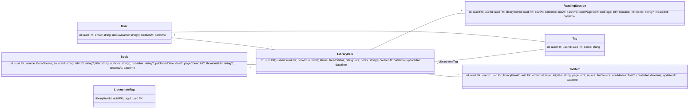

# 02_データモデル＆API仕様
最終更新: 2025-08-31 (JST)

## 1. データモデル（ER）


### 列挙/インデックス
- `ReadStatus = { TO_READ, READING, FINISHED, ON_HOLD, DROPPED }`
- `BookSource = { GOOGLE, OPEN_LIBRARY, MANUAL }`
- `TocSource = { MANUAL, OCR, IMPORT }`
- 推奨インデックス: `LibraryItem(userId,status)`, `ReadingSession(userId,startAt DESC)`, `Book(source,sourceId)`, `TocItem(libraryItemId,order)`

### Prisma方針
- 外部キーは `onDelete: CASCADE` を適用可能箇所に提案
- RLS想定のため全テーブルに `userId` を保持（Bookは共有、LibraryItem/TocItemはユーザー所有）

## 2. API（REST）
ベース: `/api/v1`、JSON、JWT。

### 2.1 書籍検索
- `GET /books/search?q=...&page=1&pageSize=20` → `{ items: BookDTO[], nextPage?: number }`

### 2.2 本棚（LibraryItem）
- `POST /library-items` `{ bookId, status?, rating?, notes? }`
- `GET /library-items?status=...&query=...`（ページング）
- `PATCH /library-items/:id`
- `DELETE /library-items/:id`

### 2.3 読書セッション
- `POST /reading-sessions` `{ libraryItemId, startAt, endAt, startPage?, endPage?, memo? }`
- `GET /reading-sessions?from=YYYY-MM-DD&to=YYYY-MM-DD`
- `DELETE /reading-sessions/:id`

### 2.4 タグ
- `POST /tags { name }` / `GET /tags`
- `POST /library-items/:id/tags { tagId }`

### 2.5 統計/エクスポート
- `GET /stats/summary?month=YYYY-MM` → `{ totalMinutes, totalBooks, streakDays }`
- `GET /exports/csv?scope=all` → CSV（books/library_items/reading_sessions/*toc*）

### 2.6 目次 (ToC)
- `GET /library-items/:id/toc` → `{ items: TocItemDTO[] }`
- `POST /library-items/:id/toc/preview` → 入力テキスト/OCR結果を解析し、**保存せず**プレビューを返す
- `POST /library-items/:id/toc` → **一括Upsert**（プレビュー確定後）
- `PATCH /toc-items/:tocItemId` / `DELETE /toc-items/:tocItemId`

#### DTO 例
```ts
type TocSource = 'MANUAL' | 'OCR' | 'IMPORT'

type TocItemDTO = {
  id: string
  order: number
  level: number
  title: string
  page?: number
  source: TocSource
  confidence?: number
}

type TocItemInput = Omit<TocItemDTO,'id'> & { id?: string }
```

### 2.7 エラーフォーマット
```json
{
  "error": {
    "code": "VALIDATION_ERROR",
    "message": "endAt must be after startAt",
    "details": [{"field":"endAt","reason":"after_startAt"}]
  }
}
```

## 3. 検索アダプタ方針
- `BookProvider` 抽象を定義し、Google/OpenLibrary 実装。低速/失敗時フォールバック、簡易キャッシュ。

## 4. CSV 仕様（初期）
- `books.csv`: id,title,authors,isbn13,publishedDate,pageCount
- `library_items.csv`: id,bookId,status,rating,notes,createdAt
- `reading_sessions.csv`: id,libraryItemId,startAt,endAt,minutes,startPage,endPage,memo
- `toc.csv`: id,libraryItemId,order,level,title,page,source,confidence

