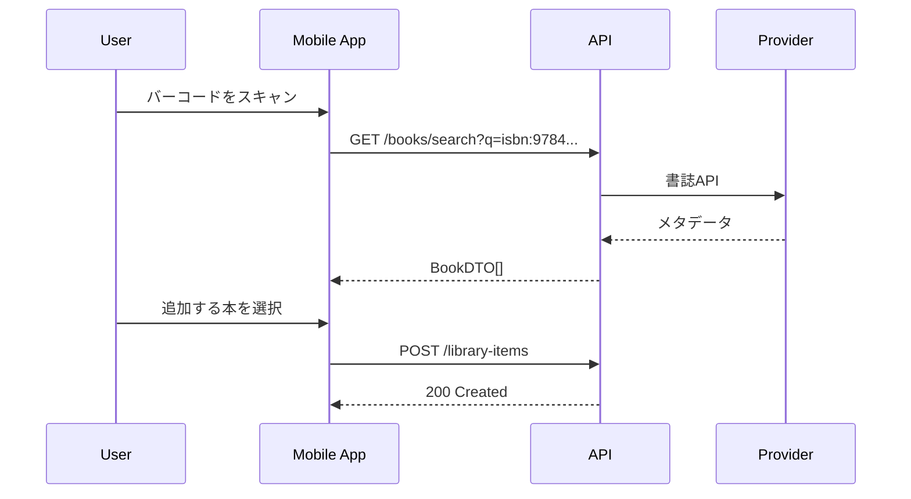
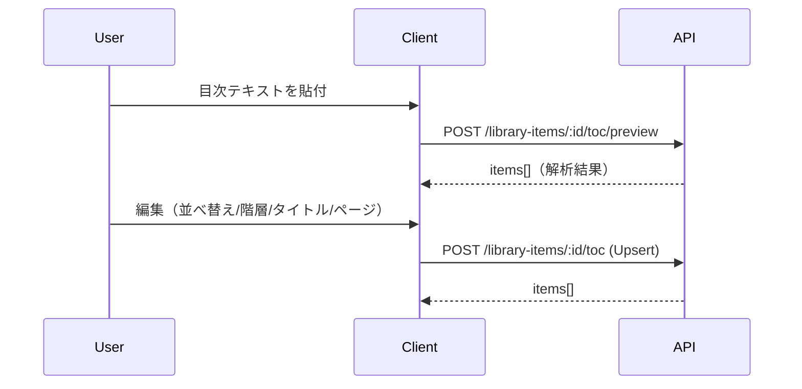

# 03_UI/UX設計（画面仕様・編集UI）
最終更新: 2025-08-31 (JST)

## 1. 画面一覧（MVP）
1. **Onboarding/Login**（Email Link / OAuth）
2. **Home / Today**：直近の本カード、ワンタップ記録、今日の合計時間/ストリーク
3. **Library**：フィルタ(状態/タグ)、ソート、検索、**ビュー切替（サムネ/テキスト）**
4. **Book Detail**：書影、メタデータ、状態/タグ/評価、累計時間、最近のセッション、**目次タブ**
5. **Reading Session Timer**：開始/停止、ページ/メモ入力、後追い編集
6. **Stats**：月次時間/冊数、ストリーク（P2で週/月集計強化）
7. **Settings**：プロフィール、通知、データエクスポート

## 2. 主要画面の要素
### 2.1 Library
- トグル: **サムネ ↔ テキスト**（ユーザー設定に保存）
- サムネ: カード（書影/タイトル/進捗%/状態チップ）
- テキスト: ディレクトリ風リスト（分類→棚→本）
- コンテキスト操作: 追加/移動/タグ/削除

### 2.2 Book Detail
- 基本: 書影・タイトル/著者・出版社・出版年・状態・タグ・★評価
- アクション: [記録開始] [目次を追加] [エクスポート]
- **タブ**: 概要 / 目次 / セッション / 統計

### 2.3 ToC（目次）タブ（P1: 手動、P2: OCR）
- 入力選択: **手動**（テキスト貼付/入力） / **OCR**（モバイル端末内）
- プレビュー: 自動パース結果をツリー表示（order/level/title/page/confidence）
- 編集: 上下移動、インデント/アウトデント、タイトル/ページ編集、行の追加/削除
- 確定: **一括保存（Upsert）**

## 3. フロー（例）
### 3.1 ISBN スキャン→追加（モバイル）

### 3.2 目次作成（手動→プレビュー→保存）

## 4. 編集UIルール
- インデント/アウトデントで `level` を変更
- 連番（order）はUIで自動再採番
- 失敗行（confidence=0）は**注意表示**、保存前に編集を促す
- キーボード操作（↑↓, Tab/Shift+Tab）で編集可能（アクセシビリティ）

## 5. アクセシビリティ/国際化
- WCAG準拠（コントラスト、フォーカスリング）
- ARIA属性、代替テキスト
- 日本語を基準。将来のi18n拡張を想定した文言管理

## 6. 設定の永続化
- ビュー切替や並び順などはユーザー設定としてサーバ保存（端末間で同期）

